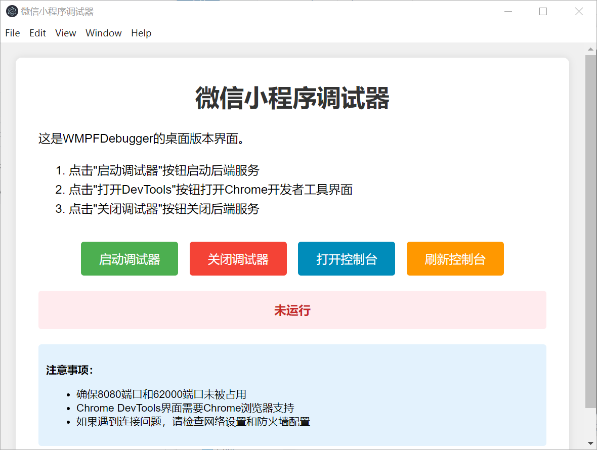
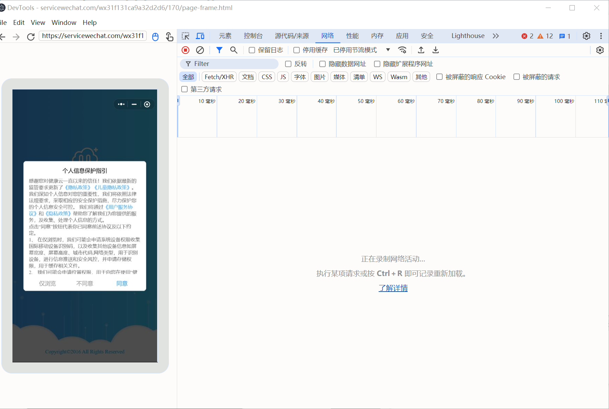

# WMPFDebugger 桌面版本使用说明

## 简介

这是WMPFDebugger的桌面版本界面，提供了一个简单的UI来管理调试器的启动和DevTools的打开。

## 功能

- 启动/停止调试器后端服务
- 打开Chrome DevTools界面
- 显示调试器运行状态

## 安装依赖

在项目根目录下运行：

```bash
npm install
```

## 运行桌面应用

```bash
运行.bat
```


### 在项目根目录下运行：

```bash
npm run ui
```


## 目录结构

```
UI/
├── main.js          # Electron主进程文件
├── index.html       # 简单HTML界面
└── README.md        # 本说明文档
```

## 技术说明

- Electron应用通过`main.js`管理应用生命周期和窗口
- 后端服务启动后，桌面应用会自动加载Chrome DevTools界面
- 关闭桌面应用时，后端服务也会自动停止

## 注意事项

1. 确保8080端口和62000端口未被占用
2. Chrome DevTools界面需要Chrome浏览器支持
3. 如果遇到连接问题，请检查网络设置和防火墙配置

## 作者

1. 因为技术原因我并不会在更新UI
2. 如大佬更新自动替换配置文件就可以继续食用
3. 开发不易 点点星星
## 成品展示




